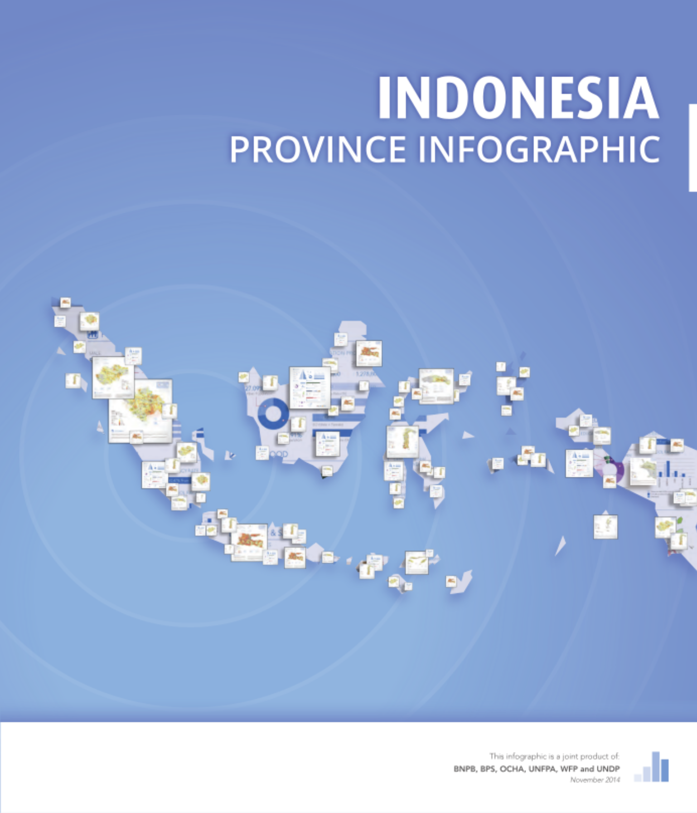
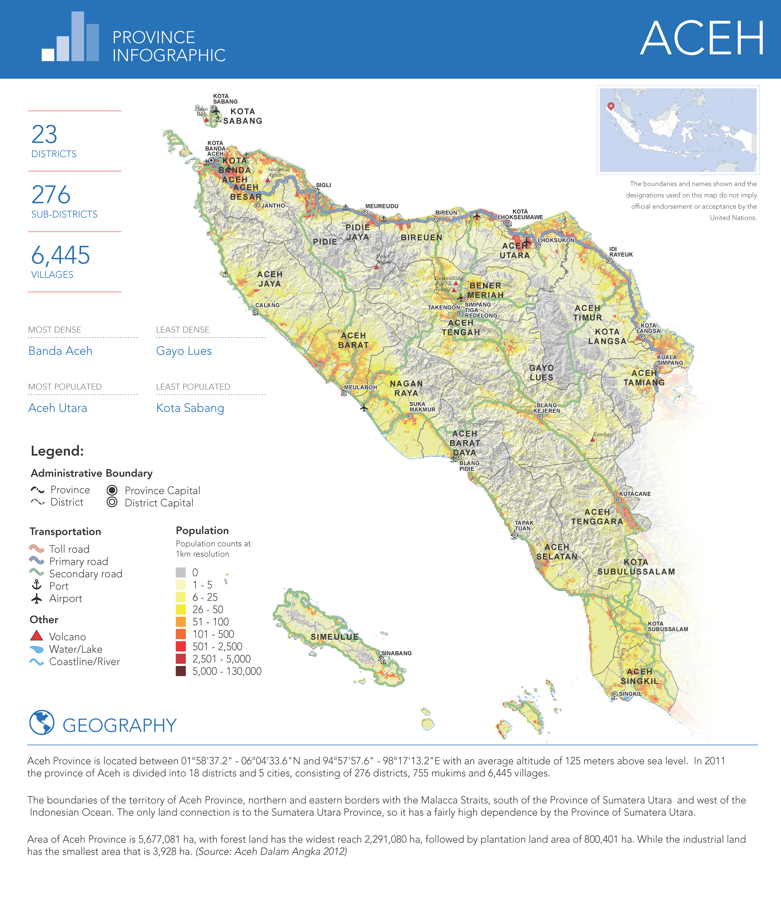
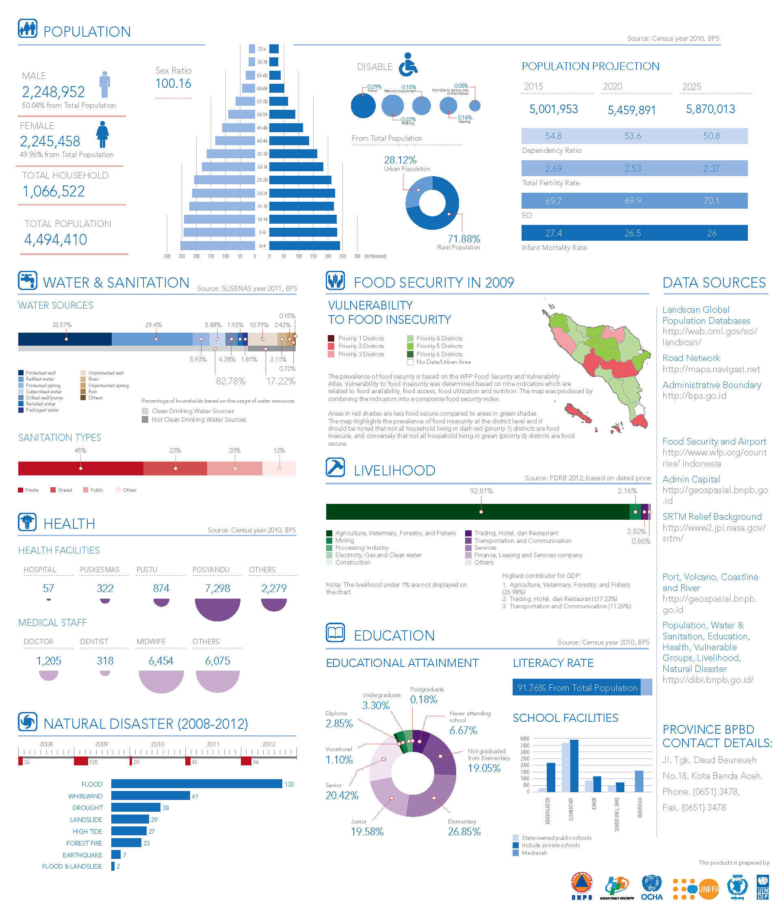

On 27 November 2014, at a national seminar in Jakarta, the Indonesia National Disaster Management Agency (BNPB) and the National Statistics Office (BPS) launched a new publication on data for disaster management. The "Province Infographic" book was developed in cooperation with BNPB and BPS, with technical support from several United Nations agencies including UNFPA, OCHA, WFP and UNDP. The multi-stakeholder cooperation behind it is an innovative way of using integrated data, collected from various parties, for humanitarian purposes.

::: {.project-meta}
::: {.meta-item}
::: {.meta-label}
Year
:::
::: {.meta-value}
2014
:::
:::

::: {.meta-item}
::: {.meta-label}
Organization
:::
::: {.meta-value}
[World Food Programme](../experiences.qmd#exp-wfp-gis-officer)
:::
:::

::: {.meta-item}
::: {.meta-label}
Partners
:::
::: {.meta-value}
BNPB and BPS, with UNFPA, OCHA and UNDP
:::
:::

::: {.meta-item}
::: {.meta-label}
Tools
:::
::: {.meta-value}
ArcGIS 10.2.2, Adobe Illustrator, Tableau
:::
:::

::: {.meta-item}
::: {.meta-label}
Team
:::
::: {.meta-value}
[Dikot Pramdoni Harahap](https://id.linkedin.com/in/dharahap), [Suprapto](https://id.linkedin.com/in/suprapto-bnpb-34b02535), Ratih Nurmasari, [Theopilus Yanuarto](https://id.linkedin.com/in/theophilus-yanuarto-a36b15a0), [Narwawi Pramudhiarta](https://id.linkedin.com/in/awinxgeo), Muhammad Rifat, [Faizal Thamrin](https://id.linkedin.com/in/faizalthamrin), Benny Istanto, [Atik Widyastuti](https://id.linkedin.com/in/atikwidyastuti), [Adi Kurniawan](https://id.linkedin.com/in/samnawi), [Felix Yanuar](https://id.linkedin.com/in/felix-wicaksono)
:::
:::
:::

The infographics give BNPB, other government bodies, and national and international actors a fast and reliable reference for policy planning and analysis in disaster preparedness and humanitarian response.

The book contains maps and graphics on Indonesia's provinces and their populations, focused on seven sectors: population, food security, livelihoods, education, health, water and sanitation, and disasters.

## Download the book

- Reliefweb - [English](https://reliefweb.int/report/indonesia/indonesia-province-infographic-book-27-nov-2014)

High resolution PDF files of the book are available for download from my personal collection. The book is available in both English and Bahasa Indonesia.

- [English](https://drive.google.com/file/d/1EIRa0VcDOqneEu7oEEkLJUdsp08KouZF/view?usp=sharing)
- [Bahasa Indonesia](https://drive.google.com/file/d/1dPRzOeT7TtXeIjNGGKebwVeEgnn8KIj4/view?usp=sharing)

## Example: Aceh province

Each province gets a two-page spread. The first page carries the population density map and the administrative summary; the second brings together the sectoral indicators.

## References

- [BNPB publication page](https://bnpb.go.id/buku/indonesia-infografis-provinsi)
- [UNFPA Indonesia summary](https://indonesia.unfpa.org/en/publications/summary-indonesia-province-infographic-disaster-preparedness-and-planning-english)
- [ReliefWeb report](https://reliefweb.int/report/indonesia/indonesia-province-infographic-book-27-nov-2014)
- [Datasets on HDX](https://data.humdata.org/dataset/indonesia-province-infographic-datasets)

::: {.back-link}
[← Back to Projects](../projects.qmd)
:::
