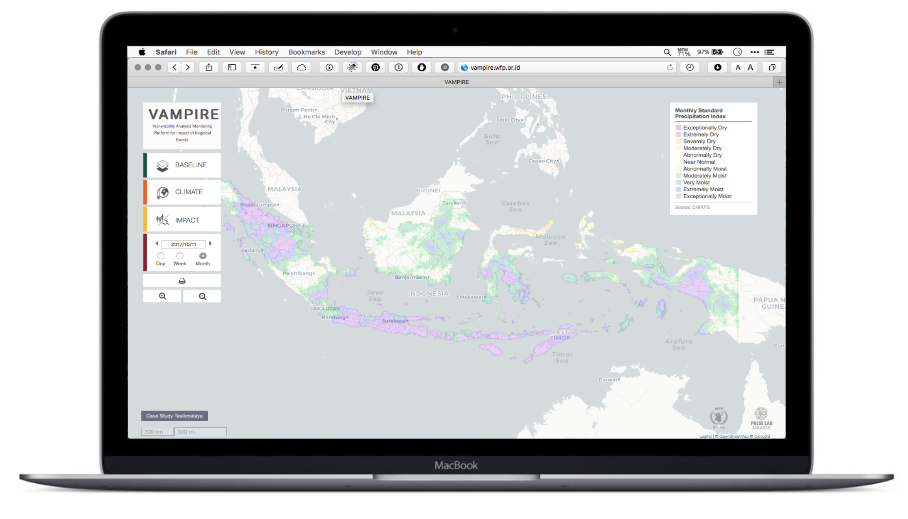
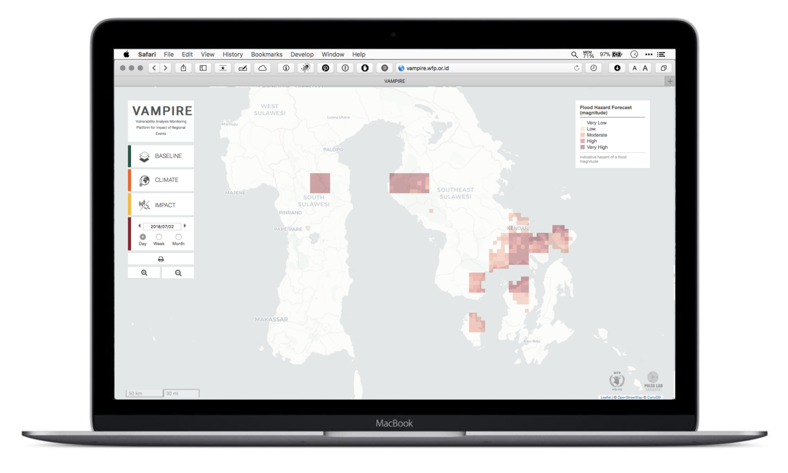
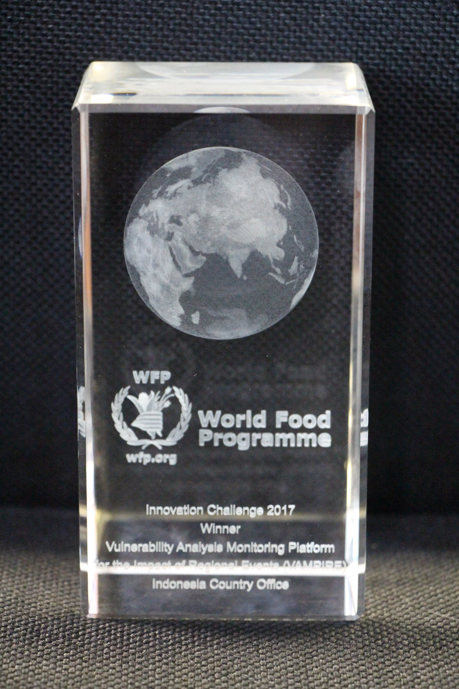
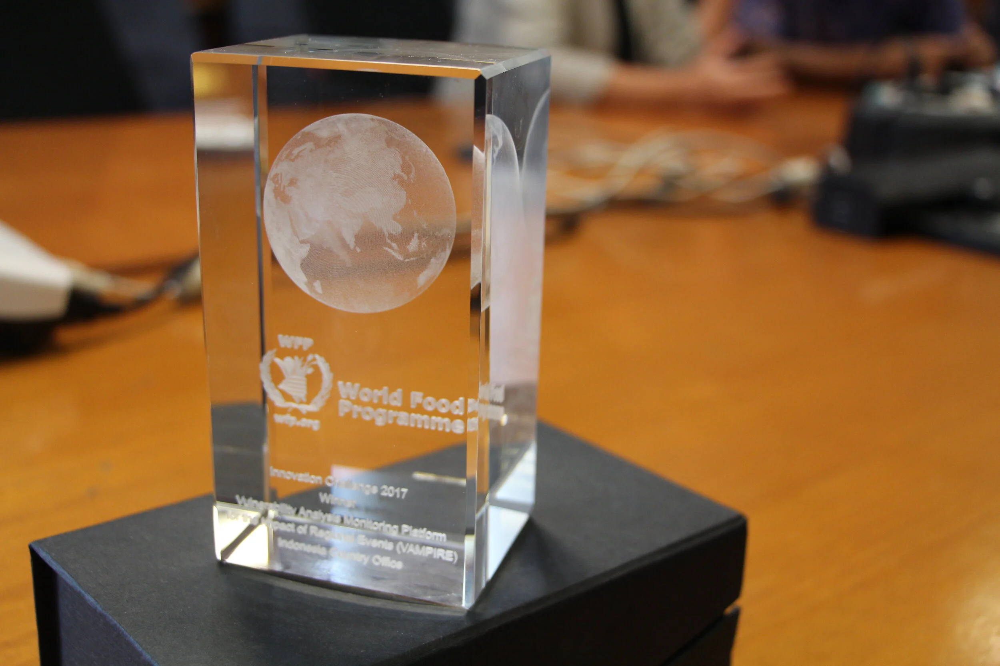

WFP's VAMPIRE system gives a public interface to data on environmental conditions such as drought, flood and El Nino, and their impact on food security in Indonesia. It also acts as an access point for other organisations and researchers who want the data for their own analysis.

::: {.project-meta}
::: {.meta-item}
::: {.meta-label}
Year
:::
::: {.meta-value}
2015 - 2018
:::
:::

::: {.meta-item}
::: {.meta-label}
Organization
:::
::: {.meta-value}
WFP Indonesia Country Office
:::
:::

::: {.meta-item}
::: {.meta-label}
Partner
:::
::: {.meta-value}
[Pulse Lab Jakarta](https://www.pulselabjakarta.org)
:::
:::

::: {.meta-item}
::: {.meta-label}
Tools
:::
::: {.meta-value}
ArcGIS Desktop, ArcGIS Server, arcpy, Python, NumPy, GDAL/OGR, rasterio, GeoServer, PostgreSQL/PostGIS
:::
:::

::: {.meta-item}
::: {.meta-label}
Team
:::
::: {.meta-value}
2015-2016: [Amit Wadhwa](https://www.linkedin.com/in/amitwadhwa00), [Rochelle Ohagan](https://www.linkedin.com/in/rochelle-ohagan), Benny Istanto 2017-2018: Katarina Kohutova, [Dio Dinta Dafrista](https://at.linkedin.com/in/dio-dinta-dafrista-5b88126a)
:::
:::

::: {.meta-item}
::: {.meta-label}
Reference
:::
::: {.meta-value}
[vampire.idn.wfp.org](https://vampire.idn.wfp.org/) · [WFP Innovation Challenge](https://medium.com/@WFPInnovation/wfp-staff-show-entrepreneurial-side-in-annual-competition-be03924215)
:::
:::
:::

## What it does

VAMPIRE is a multi-tier system that fuses satellite climate data, crowd-sourced food price data and household survey data into integrated views of how far a drought has spread, what it does to market structure and pricing, and how affected populations cope. Data acquisition and processing are automated, so participating organisations and governments always have current information. New data themes drop in without redesign, and the system was built to be applied to other regions, for example Papua New Guinea and Timor-Leste.

## Two implementations

VAMPIRE was originally built for the WFP Indonesia Country Office, to automate the products behind drought impact reporting. It was designed to fit the existing and proposed WFP Spatial Data Infrastructure, so it leaned on the ESRI ArcGIS suite: ArcPy, ArcMap and ArcGIS Server.

Part way through development, parts of the Government of Indonesia became interested in the system, and the design changed to add an open-source route built on open-source Python libraries, GeoServer, PostgreSQL and PostGIS. That meant reworking the system extensively to produce the Rainfall Anomaly and VHI products under open-source requirements, including automating delivery to the web dashboard.

The result is best thought of as two separate installations, the ArcGIS one and the open-source one. Most of the same Python scripts serve both, but the implementations are functionally separate and each component of the stack rests on different software, so each needs its own development, management and maintenance.

## Recognition

In 2017 VAMPIRE won the WFP Innovation Challenge.

::: {.gallery-grid}

::: {.gallery-item}
{.gallery-img}
:::

::: {.gallery-item}
{.gallery-img}
:::

:::

::: {.back-link}
[← Back to Projects](../projects.qmd)
:::
