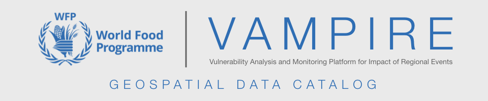
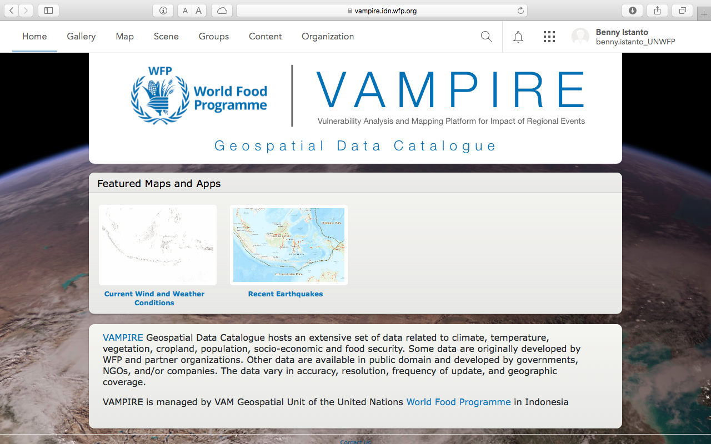
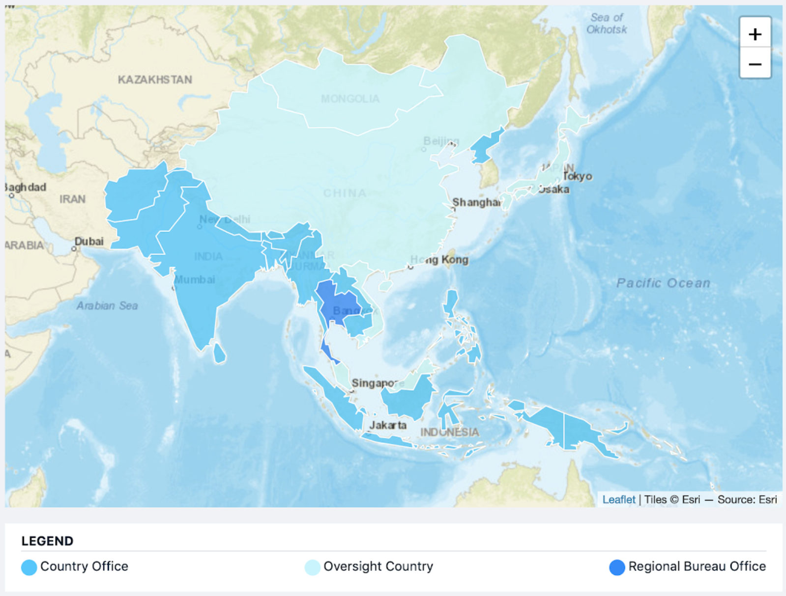
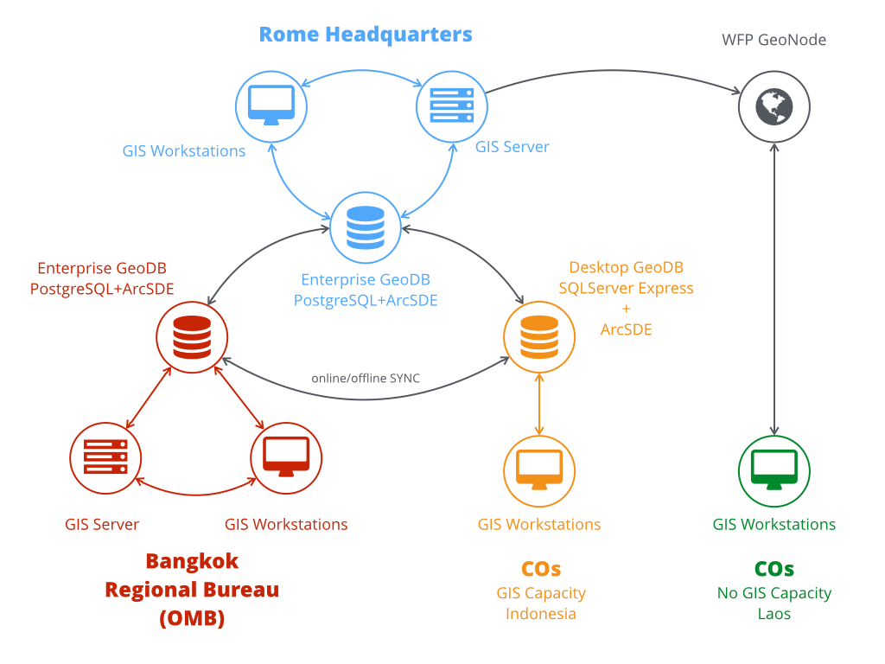

[VAMPIRE](2016-vampire.qmd) turns satellite climate data into drought and flood impact information. The Geospatial Data Catalog is the other half of that: the place where the inputs it runs on, and the products it puts out, are described and served. It was published through Portal for ArcGIS so that WFP staff, government partners and researchers could find a dataset, read what it actually is, and take it into their own analysis.

::: {.project-meta}
::: {.meta-item}
::: {.meta-label}
Year
:::
::: {.meta-value}
2017
:::
:::

::: {.meta-item}
::: {.meta-label}
Organization
:::
::: {.meta-value}
[World Food Programme, Regional Bureau for Asia and the Pacific, Bangkok](../experiences.qmd#exp-wfp-eo-climate-analyst)
:::
:::

::: {.meta-item}
::: {.meta-label}
Role
:::
::: {.meta-value}
Earth Observation and Climate Analyst
:::
:::

::: {.meta-item}
::: {.meta-label}
Platform
:::
::: {.meta-value}
Portal for ArcGIS, ArcGIS Server
:::
:::

::: {.meta-item}
::: {.meta-label}
Coverage
:::
::: {.meta-value}
22 countries: 17 country offices and 5 oversight countries
:::
:::

::: {.meta-item}
::: {.meta-label}
Related
:::
::: {.meta-value}
[VAMPIRE](2016-vampire.qmd)
:::
:::

::: {.meta-item}
::: {.meta-label}
Reference
:::
::: {.meta-value}
[Dataset list](https://wfpidn.github.io/rbb-geospatial-data) · [rbb-geospatial-data](https://github.com/wfpidn/rbb-geospatial-data) · [vampire.idn.wfp.org](https://vampire.idn.wfp.org/)
:::
:::
:::

## The portal

The catalog holds data on climate, temperature, vegetation, cropland, population, socio-economics and food security. Some of it WFP and its partners produced; the rest is public data from governments, NGOs and companies. It varies a great deal in accuracy, resolution, update frequency and geographic coverage, which is exactly why it needed a catalog rather than a shared folder. Each entry records what the dataset is, how it was made, where it came from and how to get the whole thing.

## What it serves

The source data, organised by what it measures:

- **Population and settlements.** LandScan, Facebook High Resolution Settlement Layer, JRC Global Human Settlement Layer, World Settlement Footprint
- **Weather and climate.** CHIRPS, GPM IMERG, NOAA GEFS, MODIS land surface temperature, SSEBop and MODIS evapotranspiration, MODIS snow, cloud cover climatology
- **Vegetation, cropland and land cover.** MODIS vegetation indices, MODIS and VIIRS leaf area index and FPAR, GFSAD30 and MODIS croplands, Copernicus, ESA CCI and GlobCover land cover
- **Nightlights.** VIIRS day/night band monthly cloud-free composites, annual VNL V2
- **Terrain.** NASADEM, Copernicus DEM
- **Reanalysis and gauge products.** APHRODITE, GLDAS, FLDAS

And the products derived from it, all produced on a common schedule and a common grid so that any two of them can be compared directly:

- Rainfall anomaly, as a ratio and as a difference
- Consecutive dry days and consecutive wet days
- Standardized Precipitation Index, from CHIRPS and from IMERG
- Land surface temperature anomaly and the Temperature Condition Index
- Vegetation indices anomaly, as a ratio, a difference and standardized
- Vegetation Condition Index and Vegetation Health Index

SPI is the one worth singling out, because it is the index most of the drought reporting rests on. It is served two ways: from CHIRPS at 0.05 degree over the region, 50N to 23.5S and 60E to 180E, and from IMERG at 0.1 degree globally between 60N and 60S. Both roll by dekad, at accumulation periods from 1 to 72 months, as GeoTIFF. Both ship with the same eleven-class colour table, from exceptionally dry to exceptionally moist, so a map drawn in one country office reads the same as a map drawn in another.

## Who it was for

The catalog served the Regional Bureau for Asia and the Pacific: 17 country offices and 5 oversight countries, from Afghanistan and Pakistan across to the Pacific island states. Each country has its own geodatabase, named by ISO3 code, so a country office can work offline from a local copy and synchronise when the connection allows. That last point is not a detail. Intermittent connectivity was the normal case, not the exception.

## Where it sits

The catalog is one node in WFP's Spatial Data Infrastructure, a single place for ready-to-map information shared from headquarters down to country offices. The point of it is preparedness: in the first hours of a disaster, time spent collecting, cleaning and preparing data is time not spent on the assessment. If the data is already there, described and standardised, the analysis can start immediately.

The Regional Bureau in Bangkok hosted the pilot implementation of the distributed geodatabase for country offices.

## Access

The catalog is open. Browsing the maps, apps and layers takes no account and no login, which was rather the point: data does more good in someone else's analysis than behind a sign-in page.

The dataset listing is kept alongside it in the [rbb-geospatial-data](https://github.com/wfpidn/rbb-geospatial-data) repository: what each dataset is, how the products were derived, and the symbology to draw them with.

::: {.back-link}
[← Back to Projects](../projects.qmd)
:::
