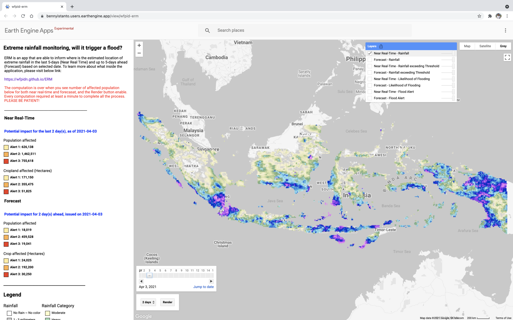
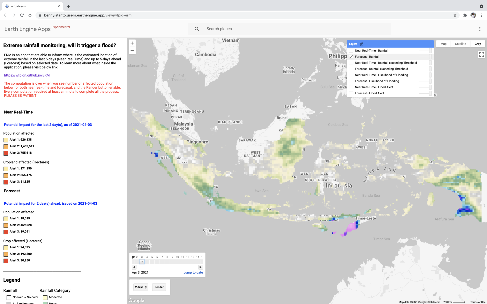
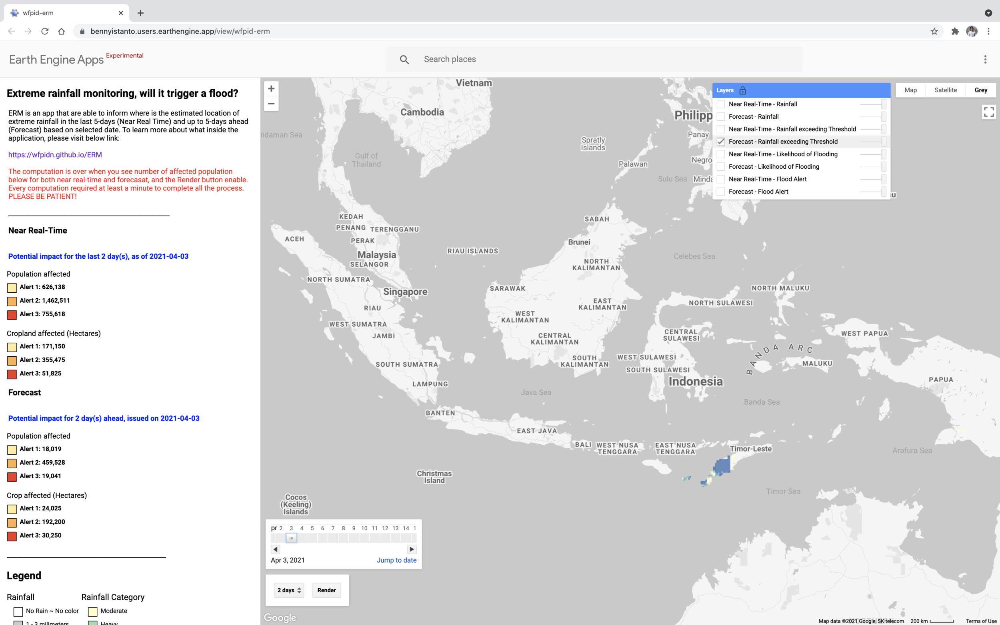
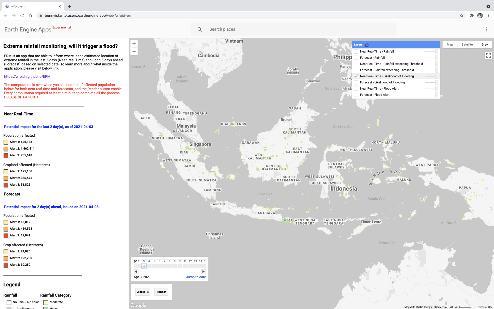
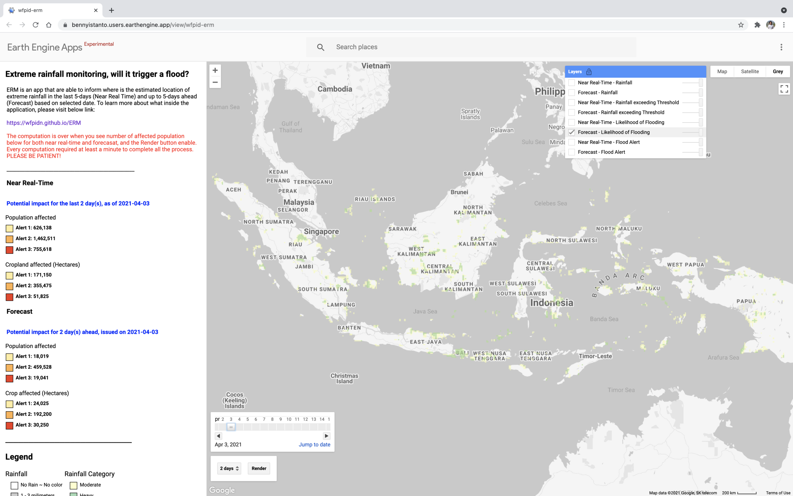
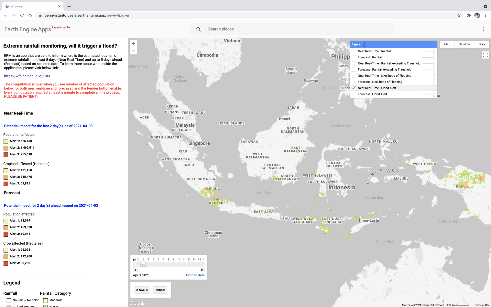

Extreme Rainfall Monitoring (ERM) is an experimental tool built by the United Nations World Food Programme in Indonesia, written for the Google Earth Engine platform. I started work on it in November 2016 with Prof. Rizaldi Boer of the Climatology Laboratory at Bogor Agricultural University as scientific advisor, along with contributors from WFP headquarters and Indonesia.

::: {.project-meta}
::: {.meta-item}
::: {.meta-label}
Year
:::
::: {.meta-value}
2016 - 2021
:::
:::

::: {.meta-item}
::: {.meta-label}
Organization
:::
::: {.meta-value}
WFP Indonesia
:::
:::

::: {.meta-item}
::: {.meta-label}
Scientific advisor
:::
::: {.meta-value}
Prof. Rizaldi Boer, Climatology Laboratory, Bogor Agricultural University
:::
:::

::: {.meta-item}
::: {.meta-label}
Tools
:::
::: {.meta-value}
Google Earth Engine. Some inputs were prepared elsewhere: ArcGIS Pro, R and Excel
:::
:::

::: {.meta-item}
::: {.meta-label}
Contributors
:::
::: {.meta-value}
Rogerio Bonifacio, Rochelle O'Hagan, Pramashavira, Michael Manalili, Anggita Annisa, Jeffry Pupella, Ridwan Mulyadi, Diego Novoa
:::
:::
:::

## What it shows

ERM estimates where extreme rainfall has fallen in the last five days and where it is forecast up to five days ahead, from a date you choose, and what that means for population and crops. It is part of the hazard monitoring module of [VAMPIRE](2016-vampire.qmd), now rebranded as PRISM. Some of the analysis was modified to suit Earth Engine, given what data is available there and the computation limits of the platform, so the methodology in the documentation still reflects what was built in VAMPIRE.

For any date, the app reports population affected and cropland affected across three alert levels, once for the near real-time window and again for the forecast window.

## The layers

Eight layers build up in four pairs. Each pair asks the same question twice, once looking back over the near real-time window and once looking forward over the forecast.

### Rainfall

Accumulated rainfall over the window.

### Rainfall exceeding threshold

Only the cells where rainfall passes the threshold that matters locally.

### Likelihood of flooding

Where that excess rainfall is likely to translate into flooding.

### Flood alert

The alert itself, graded by severity and intersected with population and cropland.

## Try it

- [Documentation](https://wfpidn.github.io/ERM)
- [Live demo](https://bennyistanto.users.earthengine.app/view/wfpid-erm)
- [Earth Engine code](https://code.earthengine.google.com/9726f90319b509450dc752a02663c066)

The app needs at least a minute to finish computing before the affected population figures appear and the Render button becomes available.

## Reference

ERM on PRISM was presented as an example application, slide 25, at NASA's GPM event: [GPM Precipitation Data and Applications](https://gpm.nasa.gov/sites/default/files/meeting_files/2021_IPWG_Workshop/GPM%20Precipitation%20Data%20and%20Applications.pdf)

::: {.back-link}
[← Back to Projects](../projects.qmd)
:::
