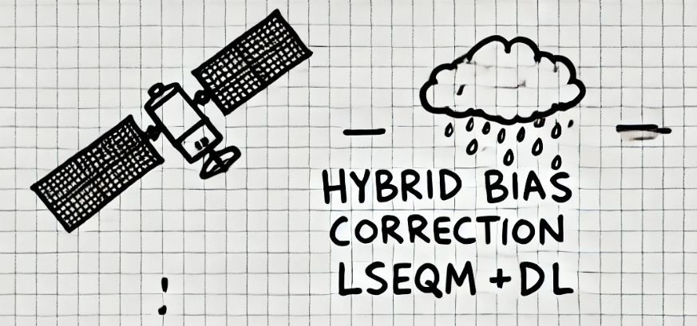
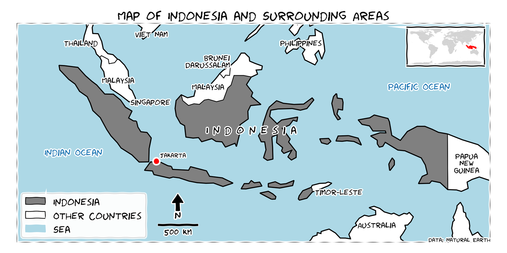
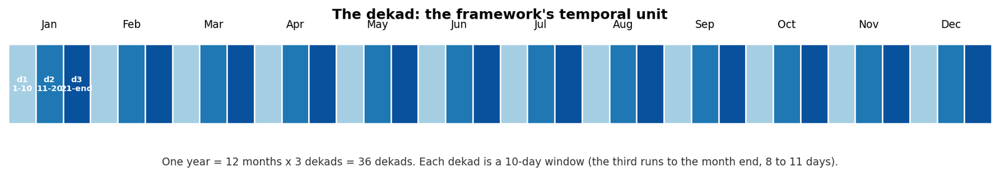
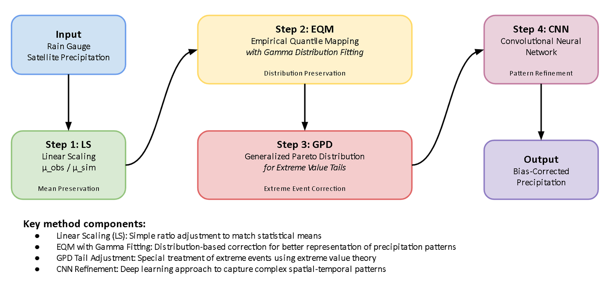
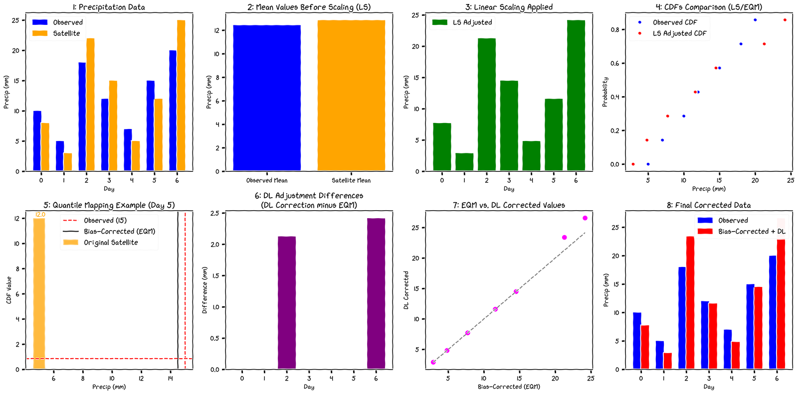
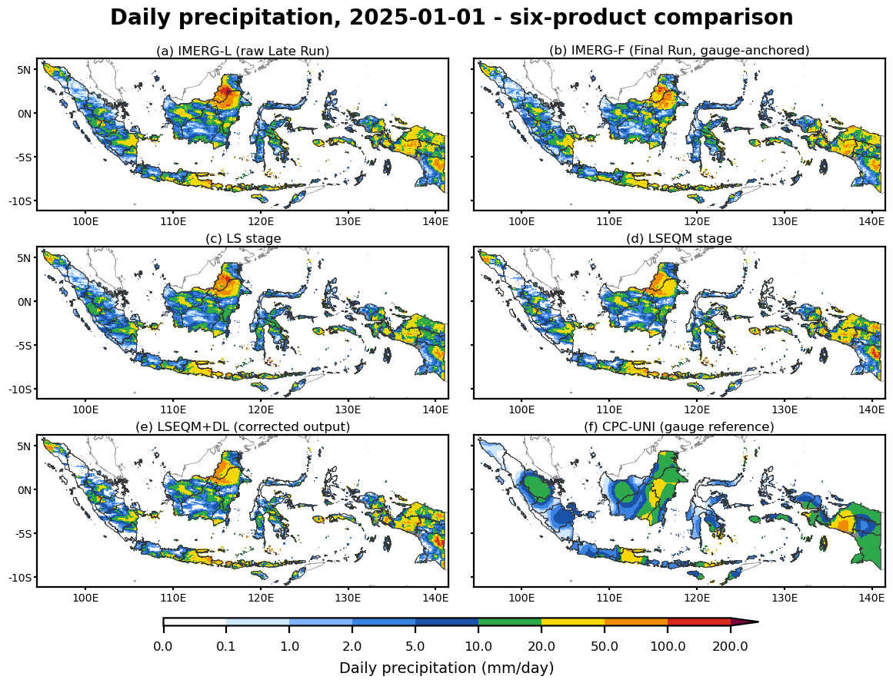
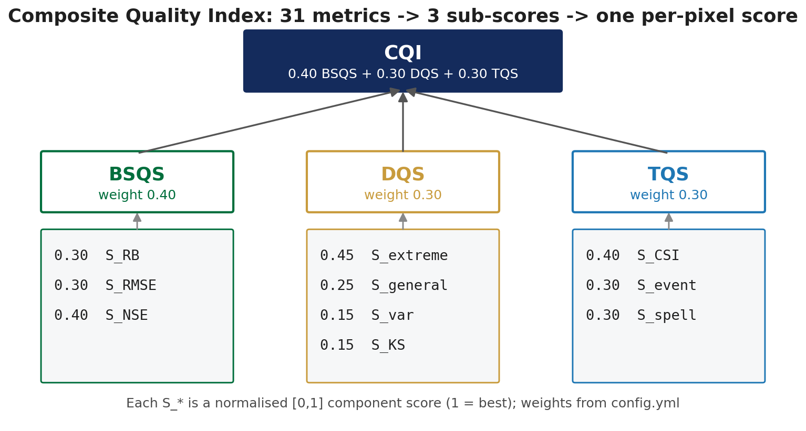

A reproducible Python framework for correcting bias in daily satellite precipitation. It combines **linear scaling** to adjust the mean, **empirical quantile mapping with a Generalized Pareto tail** to align the distribution and hold on to extremes, and a lightweight **CNN refinement** that polishes the spatial field only where station density justifies it.

::: {.project-meta}
::: {.meta-item}
::: {.meta-label}
Year
:::
::: {.meta-value}
2026
:::
:::

::: {.meta-item}
::: {.meta-label}
Programme
:::
::: {.meta-value}
MSc thesis, Applied Climatology, Department of Geophysics and Meteorology, [IPB University](https://www.ipb.ac.id/)
:::
:::

::: {.meta-item}
::: {.meta-label}
Supervisors
:::
::: {.meta-value}
[Rizaldi Boer](https://scholar.google.com/citations?user=jTPXEp8AAAAJ&hl=en) and [I Putu Santikayasa](https://scholar.google.com/citations?user=DcQ58z8AAAAJ&hl=en)
:::
:::

::: {.meta-item}
::: {.meta-label}
Coverage
:::
::: {.meta-value}
Indonesia, 2001 to 2025, on the 0.1 degree IMERG grid
:::
:::

::: {.meta-item}
::: {.meta-label}
Tools
:::
::: {.meta-value}
Python, xarray, TensorFlow
:::
:::

::: {.meta-item}
::: {.meta-label}
License
:::
::: {.meta-value}
Mozilla Public License 2.0
:::
:::

::: {.meta-item}
::: {.meta-label}
Links
:::
::: {.meta-value}
[Documentation](https://bennyistanto.github.io/hybrid-bias-correction) · [GitHub](https://github.com/bennyistanto/hybrid-bias-correction) · [Dashboard](https://bennyistanto.github.io/hybrid-bias-correction/viz/)
:::
:::
:::

## Where and at what step

The framework was built and tested operationally over Indonesia, on the 0.1 degree IMERG grid, from 2001 to 2025.

Correction is fitted per dekad rather than per month or per day. A dekad is a ten-day window, three to a month, so a year has 36 of them. That is short enough to follow the seasonal cycle and long enough to leave a usable sample for fitting a distribution.

## The method

Four stages, each fixing something the previous one leaves behind. Linear scaling gets the mean right but leaves the shape wrong. Quantile mapping fixes the shape but flattens the tail. A Generalized Pareto tail restores the extremes. The CNN then cleans up the spatial pattern, gated by how much station evidence there is at each pixel.

## What it produces

## Judging the result

Rather than lean on a single score, the quality of each pixel is summarised from 31 metrics collapsed into three sub-scores: how well values match, how well the distribution aligns, and how well events are detected.

The framework is checked along three independent lines:

- **Held-out gauges.** The corrected output is scored against 171 BMKG stations that were not used in the correction. Across value adjustment, distribution alignment, extreme preservation and event detection, the final output moves three of the four cleanly toward the gauge target and trades off the fourth by design.
- **Sensitivity.** Across fifteen combinations of `blend_alpha`, `gpd_threshold_percentile` and `saturation_count` on the Bali subdomain, the Pearson correlation stays inside [0.332, 0.348] and no setting reverses the headline pattern.
- **Code.** A synthetic-data smoke suite covers the import surface, the distribution fitting, the station-density confidence machinery and the blending algebra. It runs in under a second and gates every push.

## Running it

Colab is the recommended route, because TensorFlow is already installed there and the GPU is provisioned, so the CNN step works without any setup. The repository ships an 11 MB Bali example that runs end to end in about fifteen minutes on a free Colab CPU, through a seven-notebook pipeline from AOI definition to visualisation.

The full Indonesia inputs and outputs are too large for a repository, so they are deposited on Zenodo with their own DOI.

## Publication and citation

Istanto, B.; Boer, R.; Santikayasa, I.P. A Modular and Transferable Framework for Enhancing Satellite-Derived Daily Precipitation: Adjusting Values, Aligning Distributions, and Preserving Extremes. *Remote Sens.* **2026**, *18*, 2298. <https://doi.org/10.3390/rs18142298>

- Paper: [10.3390/rs18142298](https://doi.org/10.3390/rs18142298)
- Software release: [10.5281/zenodo.20473507](https://doi.org/10.5281/zenodo.20473507)
- Data archive: [10.5281/zenodo.20287846](https://doi.org/10.5281/zenodo.20287846)

::: {.back-link}
[← Back to Projects](../projects.qmd)
:::
