**precip-index** is a lightweight set of Python scripts for calculating precipitation-based climate indices, SPI and SPEI, and for analysing dry and wet extremes using run theory. It is built for gridded `xarray` workflows.

::: {.project-meta}
::: {.meta-item}
::: {.meta-label}
Year
:::
::: {.meta-value}
2026
:::
:::

::: {.meta-item}
::: {.meta-label}
Organization
:::
::: {.meta-value}
GOST / DEC Data Group, The World Bank
:::
:::

::: {.meta-item}
::: {.meta-label}
Tools
:::
::: {.meta-value}
Python, xarray, NetCDF
:::
:::

::: {.meta-item}
::: {.meta-label}
Built on
:::
::: {.meta-value}
[climate-indices](https://github.com/monocongo/climate_indices) by James Adams
:::
:::

::: {.meta-item}
::: {.meta-label}
License
:::
::: {.meta-value}
BSD-3-Clause
:::
:::

::: {.meta-item}
::: {.meta-label}
Links
:::
::: {.meta-value}
[Documentation](https://bennyistanto.github.io/precip-index/) · [GitHub](https://github.com/bennyistanto/precip-index)
:::
:::
:::

## What it does

- **SPI and SPEI** at 1, 3, 6, 12 and 24-month scales, with CF-compliant NetCDF output.
- **Dry and wet in one framework.** The same API and methodology handles drought and flood-prone conditions, rather than treating wet extremes as an afterthought.
- **Multi-distribution fitting**: Gamma, Pearson Type III and Log-Logistic, so the distribution can be chosen per workflow.
- **Run theory events**: duration, magnitude, intensity, peak and inter-arrival time, plus gridded summaries.
- **Operational mode**: fit once, save the parameters, then apply them to new observations without refitting.
- **Built for large grids**: chunked tiling, memory estimation and streaming I/O, so CHIRPS, ERA5-Land and TerraClimate are practical.
- **Visualization**: event-highlighted time series, the 11-category WMO classification, and spatial maps.

## Global output

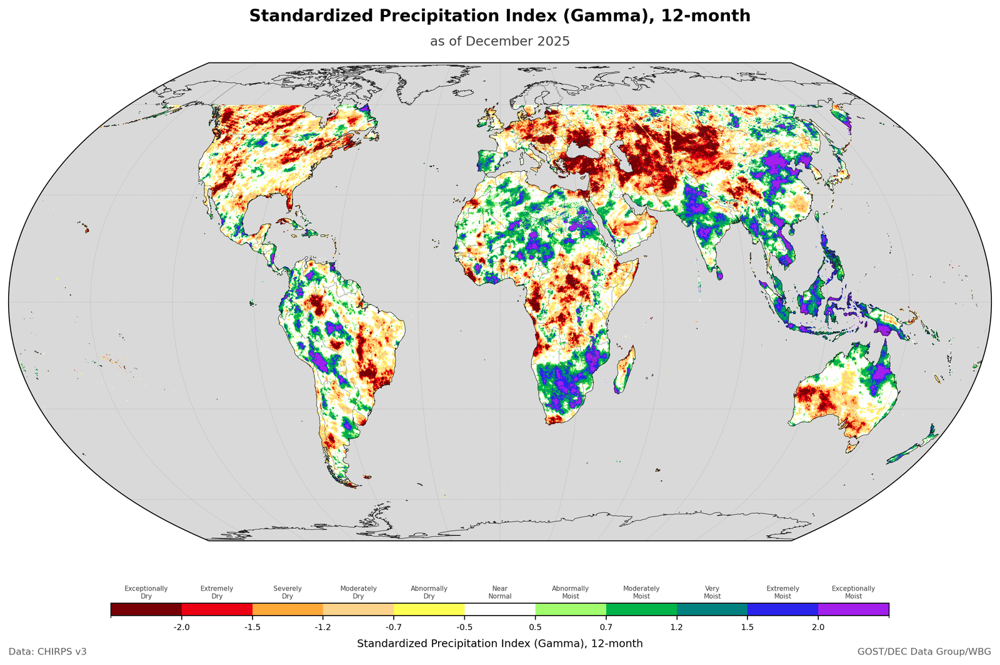

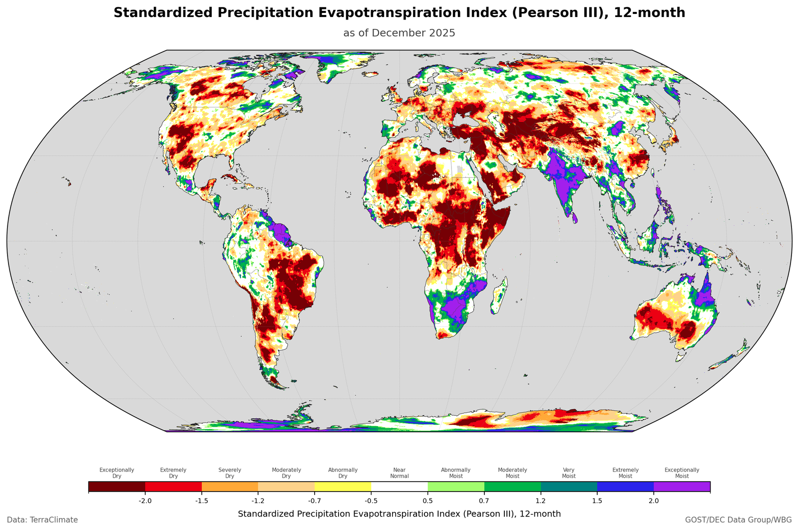

## Run theory events

Rather than counting threshold exceedances, each spell is treated as an event with its own properties.

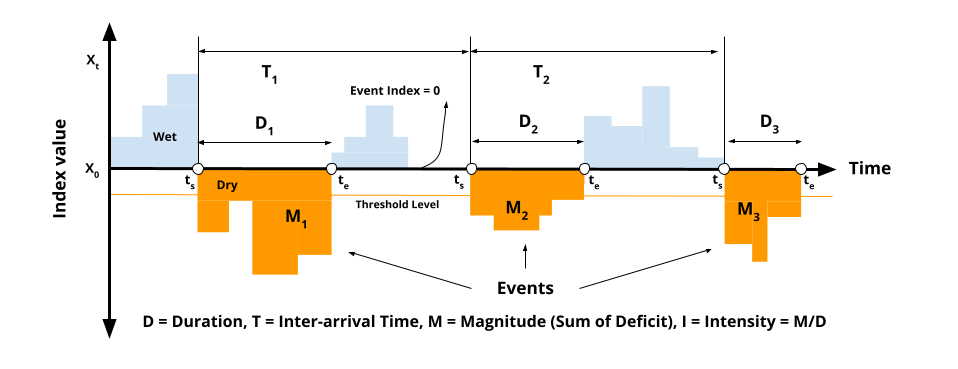

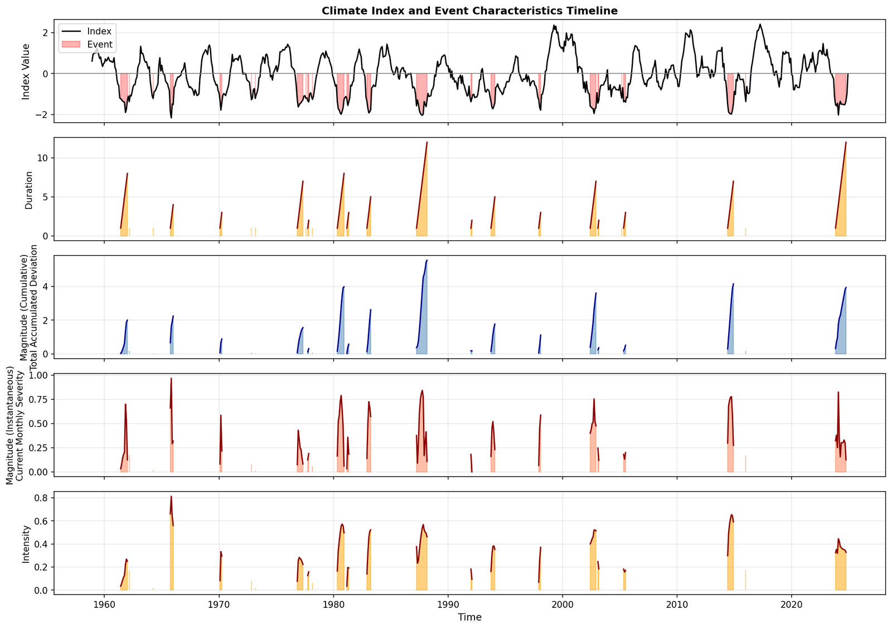

## Dry and wet, the same way

The threshold works in both directions, so a wet spell is described with the same metrics as a dry one and the two maps come from one code path.

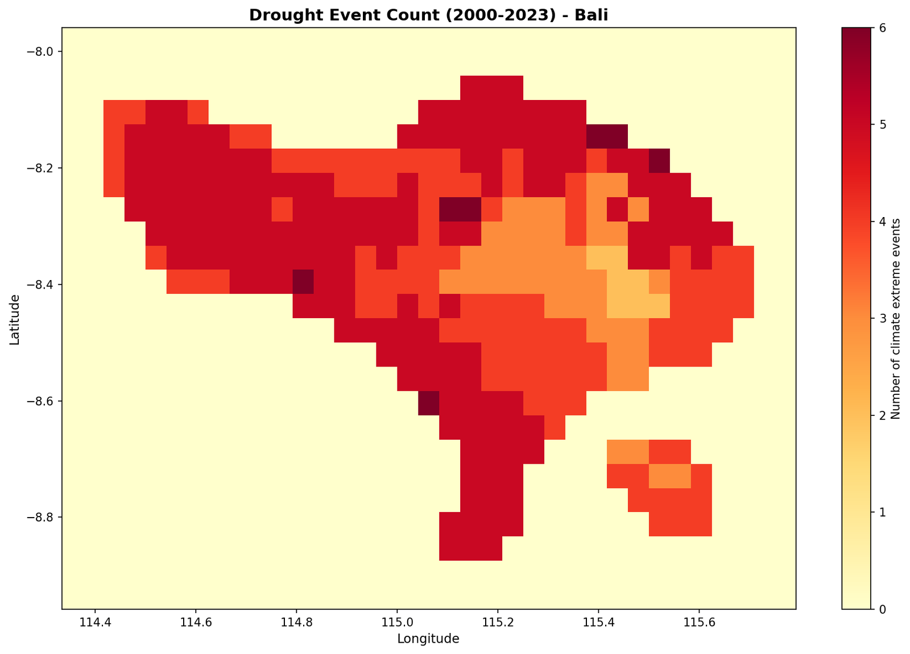

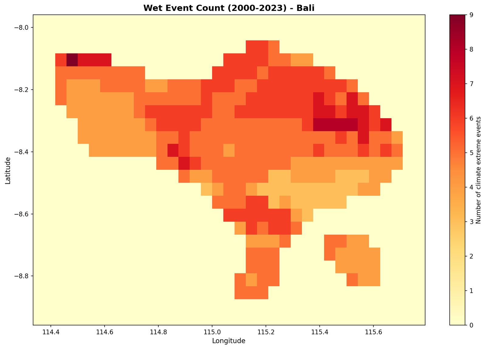

## SPI, SPEI and the PET method

SPEI subtracts potential evapotranspiration from precipitation, so the choice of PET method matters and the two indices drift apart as temperature rises.

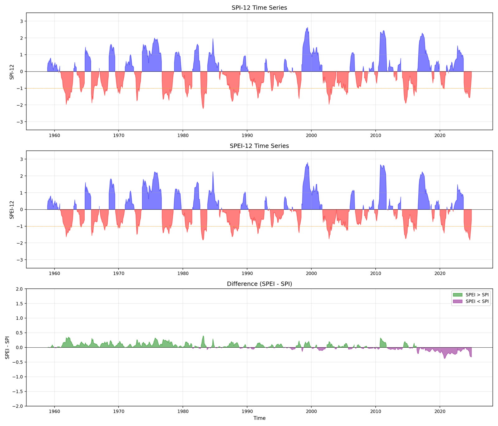

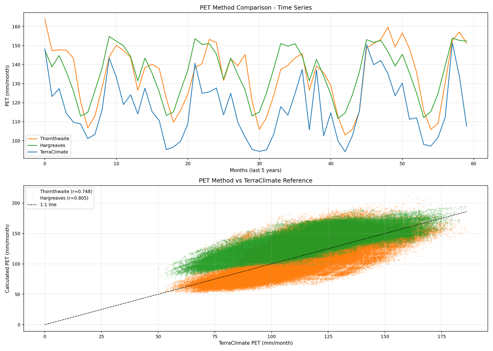

## Classification and trends

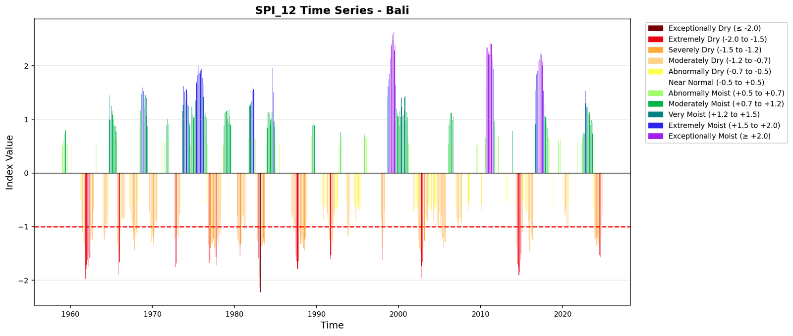

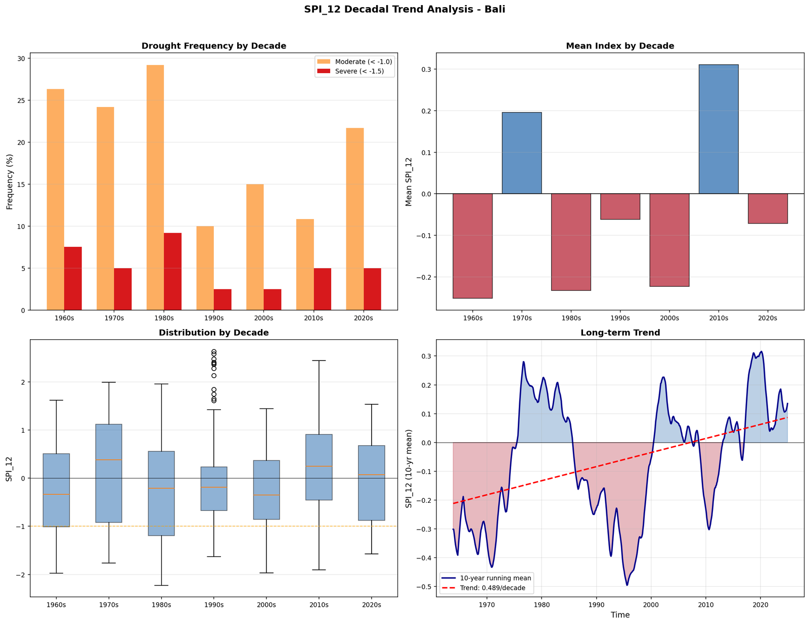

## A worked example: Bali

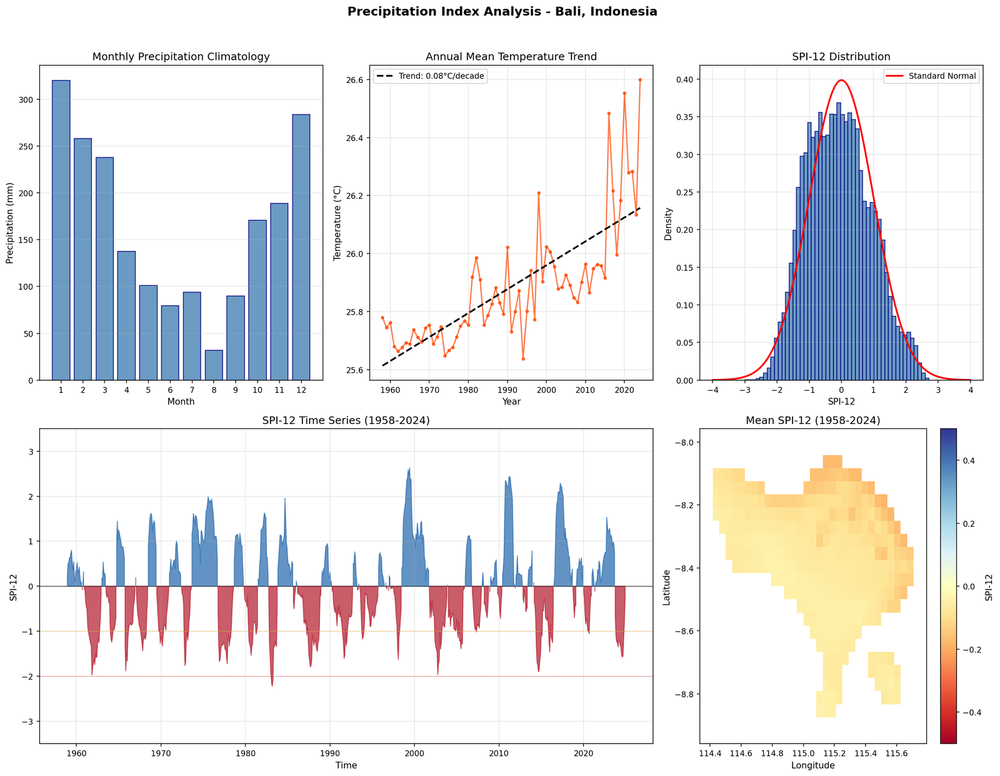

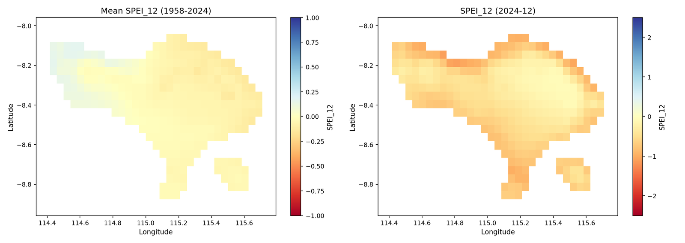

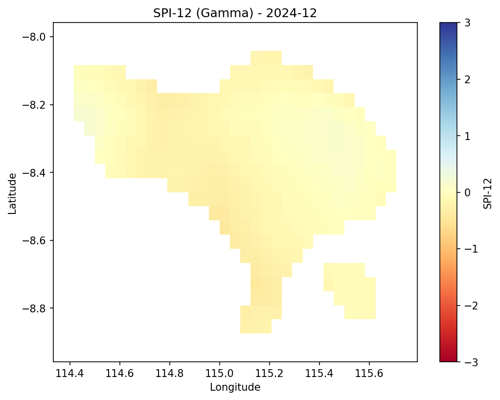

## Operational mode

For monitoring, refitting the distribution every time new data arrives is both slow and wrong: the index would shift under you. Operational mode fits once over a calibration period, saves the parameters, and applies them to everything that follows.

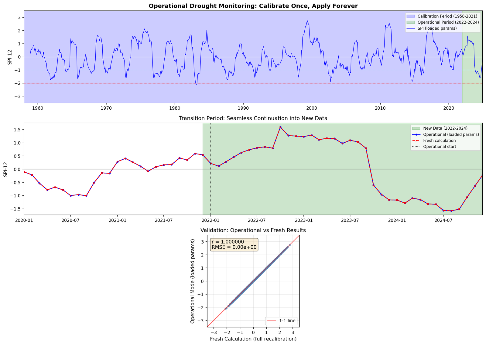

## Credits

Built on [climate-indices](https://github.com/monocongo/climate_indices) by James Adams, with additions for multi-distribution support, bidirectional event analysis, operational mode and scalable processing.

::: {.back-link}
[← Back to Projects](../projects.qmd)
:::
